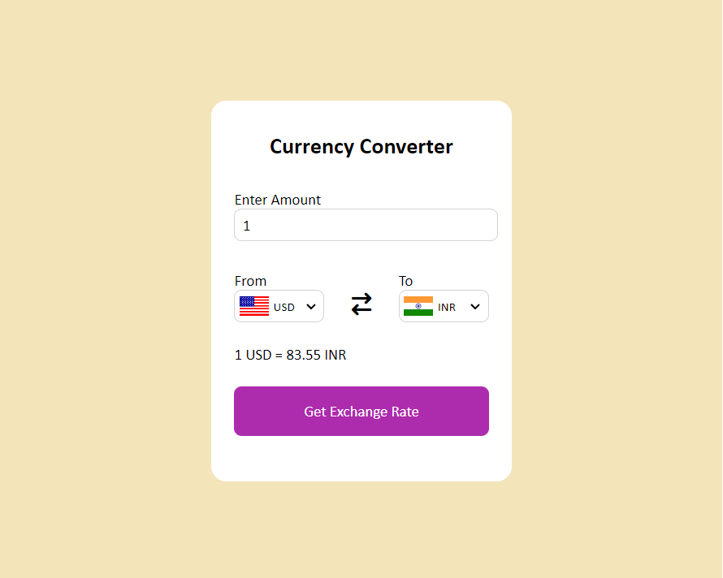

# Currency-Converter
A powerful and easy-to-use currency converter that supports exchange rates for 158 countries. This project leverages a robust API to provide real-time currency conversion rates, making it a reliable tool for developers, travelers, and anyone needing accurate and up-to-date currency exchange information.

## Currency-Converter Link
Here is my [Currency-Converter](https://currency-converter-rosy-kappa.vercel.app/) deployed on vercel.

## Features
- <b>Real-time Exchange Rates:</b> Fetches the latest exchange rates from a reliable API. 
- <b>158 Countries Supported:</b> Comprehensive support for a wide range of currencies across the globe. 
- <b>User-Friendly Interface:</b> Simple and intuitive design for easy usage. 
- <b>High Accuracy:</b> Ensures precise currency conversions with up-to-date data. 
- <b>Responsive Design:</b> Optimized for both desktop and mobile users.
